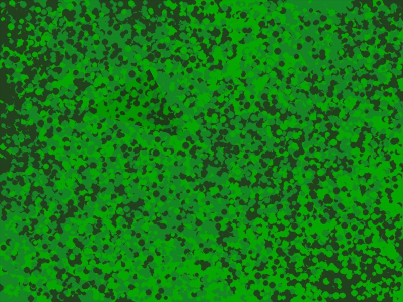

# PFNet_Plus Camouflaged Object Detection
> **Authors:** 
> [Kaney Nguyen](https://github.com/MagicKey23/) &
> [Martin Navarrete](https://github.com/mnavarrete12) 
<div align="center">
<figure>
    <a href="./">
        
    </a>
    <div class = "text-align:center">
    <figcaption>Figure 1 - Camouflaged with a pyramid</figcaption>
    </div>
</figure>

</div>


<div align="center">
<figure>
    <a href="./">
        
    </a>
    <div class = "text-align:center">
    <figcaption>Figure 2 - Ground Truth</figcaption>
    </div>
</figure>

</div>

## Introduction
- Coming Soon
## Video Demo

- Coming Soon

## Use Case
- Coming Soon

## File Structure

<pre><code>
PFNet_Plus
├── data
│   |   |
│   ├── Train
│   │   ├── image
│   │   ├── gts
│   │   |
│   ├── Test
│   │   ├── image
│   │   ├── gts
      .
      .
      .
</code></pre>


## Installation


``` shell
# clone the git hub
git clone PFNet_Plus
# go to code folder
cd yolo-net
# apt install required packages
pip install -r requirements
```

</details>

## Testing

Currently, refactoring the code

``` shell
python test.py # update soon
```

## Training

Currently, refactoring the code 

Data preparation

``` shell
python train.py # update soon
```


## Help

``` shell

```

## Inference


On image:
``` shell
python inference.py
```


## Citation

```
@InProceedings{Mei_2021_CVPR,
    author    = {Mei, Haiyang and Ji, Ge-Peng and Wei, Ziqi and Yang, Xin and Wei, Xiaopeng and Fan, Deng-Ping},
    title     = {Camouflaged Object Segmentation With Distraction Mining},
    booktitle = {Proceedings of the IEEE/CVF Conference on Computer Vision and Pattern Recognition (CVPR)},
    month     = {June},
    year      = {2021},
    pages     = {8772-8781}
}
```


## Acknowledgements

<details><summary> <b>Expand</b> </summary>

* [https://github.com/AlexeyAB/darknet](https://github.com/Mhaiyang/CVPR2021_PFNet)](https://github.com/AlexeyAB/darknet)](https://github.com/Mhaiyang/CVPR2021_PFNet)

</details>

## License

The source code is free for research and education use only.
