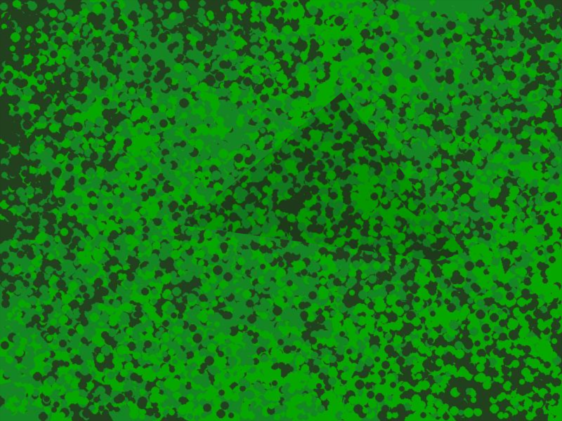
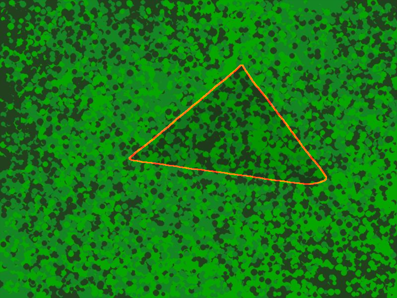

# PFNet_Plus Camouflaged Object Detection
> **Developers:** 
> [Kaney Nguyen](https://github.com/MagicKey23/) &
> [Martin Navarrete](https://github.com/mnavarrete12) 
<div align="center">
<figure>
    <a href="./">
        
    </a>
    <div class = "text-align:center">
    <figcaption>Figure 1 - Camouflaged with a pyramid</figcaption>
    </div>
</figure>

</div>


<div align="center">
<figure>
    <a href="./">
        
    </a>
    <div class = "text-align:center">
    <figcaption>Figure 2 - Ground Truth</figcaption>
    </div>
</figure>

</div>

## Introduction
- A camouflaged object refers to an item or entity that is intentionally designed, colored, or disguised to blend in with its surroundings, in order to conceal its presence or to make it difficult to be detected by visual observation. Camouflaged objects are often used in military, hunting, or wildlife photography contexts, where stealth or concealment is crucial. The object may be concealed using natural or artificial materials, such as foliage, paint, netting, or other materials, that are carefully chosen and arranged to match the texture, color, and pattern of the environment. The purpose of camouflaging an object is to make it blend in so well that it becomes nearly invisible, making it difficult to distinguish from the surrounding objects or landscape.
- This software is intergrating with PFNET. For more info about the DNN, see [paper](https://openaccess.thecvf.com/content/CVPR2021/papers/Mei_Camouflaged_Object_Segmentation_With_Distraction_Mining_CVPR_2021_paper.pdf)
## Video Demo.

- Coming Soon

## Use Case
- Medical
- Millitary 
- Environmental

## Supported OS
- MacOS(M1/M2 Chipset)
- Window
- Linux

## File Structure

<pre><code>
PFNet_Plus
├── data
│   |   |
│   ├── Train
|   |   ├── Project_Name
│   │   |   ├── image
│   │   |   ├── gts   
│   ├── Test
|   |   ├── Project_Name
│   │   |   ├── image
│   │   |   ├── gts
      .
      .
      .
</code></pre>


## Installation


``` shell

If you have trouble to install the pytorch use this code below:

pip install torch==1.12.1+cu116 torchvision==0.13.1+cu116 -f
https://download.pytorch.org/whl/torch_stable.html

# clone the git hub
git clone PFNet_Plus
# go to code folder
cd PFNet_Plus
# apt install required packages
pip install -r requirements
```


## Help

``` shell
python train.py --help
 -h, --help                           show this help message and exit
  --img_size IMG_SIZE                  The size of the input image. Adjust the
                                       train scale by specifying a value, for
                                       example: 416, 704, or 1024. Default:
                                       704
  --batch_size BATCH_SIZE              The number of samples in each batch.
                                       Adjust as needed. Default: 32
  --epochs EPOCHS                      The number of epochs to train for.
                                       Adjust as needed. Default: 100
  --last_epoch LAST_EPOCH              The index of the last epoch completed.
                                       Default: 0
  --lr LR                              The learning rate for training.
                                       Default: 0.001
  --optimizer OPTIMIZER                The optimizer to use for training. For
                                       example: Adam. Default: SGD
  --weight_decay WEIGHT_DECAY          The weight decay for regularization
                                       during training. Default: 0.0005
  --snap_shot SNAP_SHOT                Resume Training or Transfer Training
                                       Default:
  --lr_decay LR_DECAY                  The learning rate decay factor.
  --momentum MOMENTUM                  The momentum for optimizer during
                                       training. Default: 0.9
  --poly_train POLY_TRAIN              Set to True for polynomial decay
                                       learning rate during training. Default:
                                       True
  --save_point SAVE_POINT              Epochs at which to save the model
                                       weights. Enter as a list, for example:
                                       [1,10,20,30,40,50]. Default: [1, 10,
                                       20, 30, 40, 50]
  --train_path TRAIN_PATH              The path to the training data. Default:
                                       train/custom
  --dataset_path DATASET_PATH          The path to the root of the dataset.
                                       Default: ./data/
  --exp_name EXP_NAME                  Set experiment name. Default: test1
  --project_name PROJECT_NAME          Set project name. Default: project1
  --ckpt_path CKPT_PATH                The location where you want to save
                                       your training result. Default: ./ckpt
  --test_path TEST_PATH                The path to the test data. Default:
                                       test/custom
  --result_path RESULT_PATH            The path to the results. Default:
                                       ./results/
  --load_weight LOAD_WEIGHT            The path to the pre-trained weight
                                       file. Enter in the format: Path +
                                       weight_name.pth. Default: ./best.pth
  --frame_scale FRAME_SCALE            The percentage by which to upscale or
                                       downscale the camera capture. Default:
                                       100
  --load_video LOAD_VIDEO              The path to the video file to load.
                                       Enter in the format: "./monkey.mp4".
                                       Default: videoname.mp4
  --select_camera SELECT_CAMERA        The index of the camera to use. Enter
                                       as an integer value from 0 to 4.
                                       Default: 0
  --display_accuracy DISPLAY_ACCURACY  Display TP, TN, FP, FN, Accuracy. Note:
                                       Required Proper Formatting to work.
                                       Default: False
  --display_area DISPLAY_AREA          Display area accuracy. Note: Required
                                       Proper Formatting to work. Default:
                                       False
  --device DEVICE                      The index of the GPU. For example: 0,
                                       1, 2, or 3. Default: 0
  --save_video SAVE_VIDEO              Save result video Default: False
  --save_results SAVE_RESULTS          Save infer result Default: True
  --num_workers NUM_WORKERS            The number of worker threads to use.
                                       Default: 16


```


## Training

Data preparation:

``` shell
Prepare image with camouflaged and ground truth of the camouflage image:

Create two folders:
image and gts as the folder structure above
```
Example of camouflaged dataset:

Download [Camouflaged Example](https://cove.thecvf.com/datasets/326)


``` shell
Example:

python train.py --batch_size 8 --device 0 --exp_name "Pyramid" --epoch 100 --dataset_path ./data --train_path Pyramid --img_size 325

Training Log Example:
  warnings.warn(_create_warning_msg(
Namespace(img_size=704, batch_size=8, epochs=100, last_epoch=0, lr=0.001, optimizer='SGD', weight_decay=0.0005, snap_shot='', lr_decay=0.9, momentum=0.9, poly_train=True, save_point=[1, 10, 20, 30, 40, 50], device=0, train_path='Train/custom_camo', dataset_path='./data', exp_name='custom_camo', ckpt_path='./ckpt', test_path='./test/Train_Mix', load_weight='./best.pth', frame_scale=100, load_video='videoname.mp4', select_camera=0, multi_gpu=True, num_workers=16)
{'epoch_num': 100, 'train_batch_size': 8, 'last_epoch': 0, 'lr': 0.001, 'lr_decay': 0.9, 'weight_decay': 0.0005, 'momentum': 0.9, 'snapshot': '', 'scale': 704, 'save_point': [1, 10, 20, 30, 40, 50], 'poly_train': True, 'optimizer': 'SGD'}
custom_camo
From ./backbone/resnet/resnet50-19c8e357.pth Load resnet50 Weights Succeed!
SGD
Using 1 GPU(s) to Train.
  0%|                                                   | 0/134 [00:00<?, ?it/s]/usr/local/lib/python3.9/dist-packages/torch/nn/_reduction.py:42: UserWarning: size_average and reduce args will be deprecated, please use reduction='mean' instead.
  warnings.warn(warning.format(ret))
[  1], [   134], [0.000991], [8.68393], [1.17123], [1.08682], [1.07181], [1.0705
[  2], [   268], [0.000982], [6.92324], [0.90088], [0.84093], [0.82352], [0.8836
[  3], [   402], [0.000973], [5.81829], [0.79145], [0.73654], [0.71588], [0.7146
[  4], [   536], [0.000964], [5.38071], [0.73253], [0.68674], [0.66433], [0.6582
[  5], [   670], [0.000955], [5.15818], [0.69671], [0.66556], [0.63779], [0.6300
[  6], [   804], [0.000946], [5.12762], [0.71141], [0.66046], [0.63120], [0.6233
[  7], [   938], [0.000937], [5.01938], [0.68252], [0.65180], [0.61902], [0.6117
[  8], [  1072], [0.000928], [4.96626], [0.67320], [0.64332], [0.61346], [0.6057
[  9], [  1206], [0.000919], [4.92973], [0.66921], [0.63748], [0.60827], [0.6016
[ 10], [  1340], [0.000910], [4.92222], [0.66695], [0.63663], [0.60796], [0.6006
[ 11], [  1474], [0.000900], [4.89363], [0.66599], [0.63229], [0.60392], [0.5968
[ 12], [  1608], [0.000891], [4.86323], [0.66102], [0.62732], [0.60032], [0.5935
[ 13], [  1742], [0.000882], [4.84930], [0.65632], [0.62620], [0.59896], [0.5922
[ 14], [  1876], [0.000873], [4.85351], [0.65462], [0.62585], [0.59979], [0.5933
[ 15], [  2010], [0.000864], [4.81631], [0.65104], [0.62109], [0.59520], [0.5884
[ 16], [  2144], [0.000855], [4.81192], [0.65121], [0.61958], [0.59446], [0.5880
[ 17], [  2278], [0.000846], [4.79083], [0.64637], [0.61654], [0.59249], [0.5857
[ 18], [  2412], [0.000836], [4.78060], [0.64511], [0.61487], [0.59132], [0.5845
```


## Transfer Learning/Resume Training

To Resume or transfer the learning. Simply type in the epoch number.
```shell
Example: Resume at epoch 1 aka 1.pth

python train --snapshot 1 

```


</details>


## Testing

Currently, refactoring the code

``` shell
Example:

python infer.py --load_weight ./best-k-1.pth --test_path New/test/k-1 --gt_object 1 

NOTE: You must have gts folder in test or it would crash. Change gt_object 2 if there are 2 objects in the ground truth.

Test log example:

test1's average Time Is: 0.053 s
test1's average Time Is: 19.0 fps
True positive: 65.0%
True negative: 0.0%
False positive: 35.0%
False negative: 0.0%
Accuracy: 65.0%
Calculate Mask Area Accuracy...
The average accuracy for contour area is: 82.99%
Total Testing Time: 0:01:16


```

<div align="center">
<figure>
    <a href="./">
        
    </a>
    <div class = "text-align:center">
    <figcaption>Figure 3 - Result Mask</figcaption>
    </div>
</figure>
</div>


## Inference

On image:
``` shell
python infer.py --load_weight ./best-k-1.pth --test_path New/test/k-1
```

<div align="center">
<figure>
    <a href="./">
        
    </a>
    <div class = "text-align:center">
    <figcaption>Figure 3 - Result</figcaption>
    </div>
</figure>
</div>

## Camera and Video

``` shell
python detect_from_video.py --load_video video_path --load_weight weight_path 
python detect_from_camera.py --load_weight weight_path --frame_scale 100
```
## In Development

- A custom camouflaged background generator
- A image generator to add different object along with ground truth object for train/test


## Citation

```
@InProceedings{Mei_2021_CVPR,
    author    = {Mei, Haiyang and Ji, Ge-Peng and Wei, Ziqi and Yang, Xin and Wei, Xiaopeng and Fan, Deng-Ping},
    title     = {Camouflaged Object Segmentation With Distraction Mining},
    booktitle = {Proceedings of the IEEE/CVF Conference on Computer Vision and Pattern Recognition (CVPR)},
    month     = {June},
    year      = {2021},
    pages     = {8772-8781}
}

@Software{PFNet_Plus,
    author    = {Kaney Nguyen, Martin Navarrete},
    title     = {PFNet_Plus},
    webpage = {https://github.com/MagicKey23/PFNet_Plus/},
    month     = {April},
    year      = {2023}
}

```


## Acknowledgements

<details><summary> <b>Expand</b> </summary>

* [https://github.com/Mhaiyang/CVPR2021_PFNet](https://github.com/Mhaiyang/CVPR2021_PFNet)

</details>

## License

PFNET_PLUS is available under two different licenses:
- **PFNET License**: See [LICENSE](https://github.com/Mhaiyang/CVPR2021_PFNet/blob/main/License.txt) file for details.
- **MIT License**: Refer to License.txt 
- The source code is free for research and education use only. Any commercial usage should get formal permission first.


